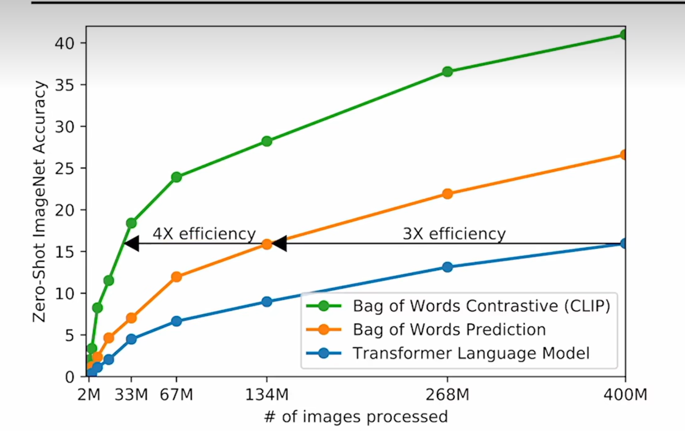
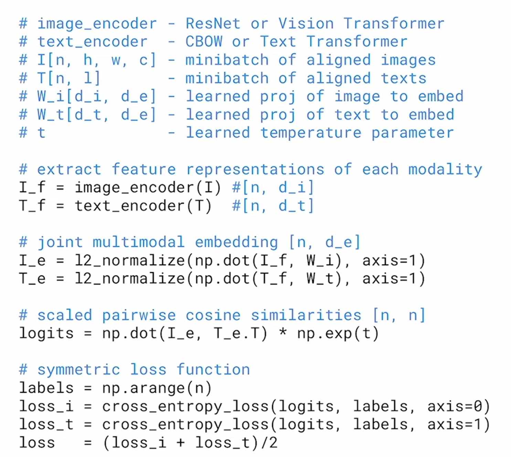
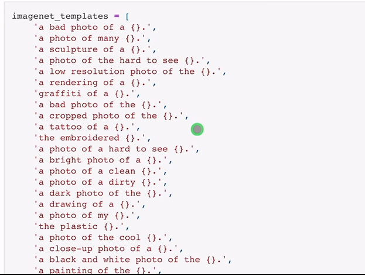

# CLIP
**论文标题：Learning Transferable Visual Models From Natural Language Supervision利用自然语言的监督信号，训练迁移性好的视觉网络**

## 预训练
对比学习  高效（任务简洁——图片与文本是否配对）

由于训练的时候图片和文字绑定，所以学到的是一个多模态的特征，而不只是一个视觉特征 
数据集名称：WIT（WebImageText）

## Zero-shot Transfer
训练一个又大又好的模型，以文本为引导，进行灵活的迁移学习

### Prompt engineering

Prompt的多义性
预训练时基本都是一个句子，很少是一个单词，可如果做推理的时候，输入只是单词，抽取出来的特征可能就不好 

CLIP的解决方案： 使用提示模版 Prompt template：“A photo of a {label}，***{a type of pet}”  如果提前知道一些信息，给出更多的提示，对于zero-shot推理非常有帮助

*模版*

## 局限
1. 如果想要在ImageNet上面达到头部算法的效果，还需要扩大1000倍的训练量，这是OpenAI都无法支撑的
2. 抽象和难的任务

## 贡献
CLIP工作最大的贡献，在于打破了固定种类标签的范式。

### 概念整理
- 混精度训练：混精度训练通过平衡精度和计算速度、内存利用之间的取舍，显著加速了深度学习训练过程
- Adam优化器:结合了动量法（Momentum）和RMSProp（Root Mean Square Propagation）的优点，通过对每个参数使用自适应的学习率来加速收敛，并且在梯度方向上具有较好的平滑性，适用于大规模数据和高维参数空间的优化。Adam优化器的核心思想是利用梯度的 一阶矩（平均梯度） 和 二阶矩（梯度的方差） 来动态调整每个参数的学习率，从而使得参数更新更加高效且稳定
- task-agnostic：表示一种方法、算法或模型具有任务无关的性质，能够适用于多个任务或领域
- web-scale 
- 超参数：在模型训练之前需要手动设置的参数，不是通过训练过程学习得到的
- 自监督学习
- 单模态对比学习 moco
- 单模态掩码学习 mae
- accelerator year：加速器年，一种衡量算力的计算逻辑，方便做训练量对比