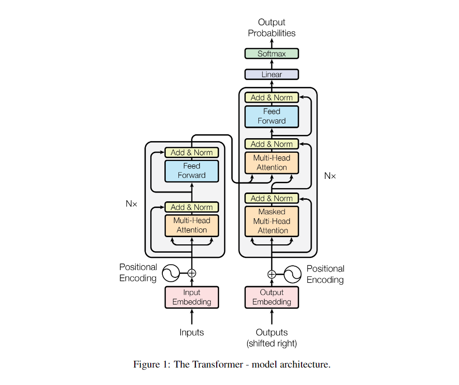
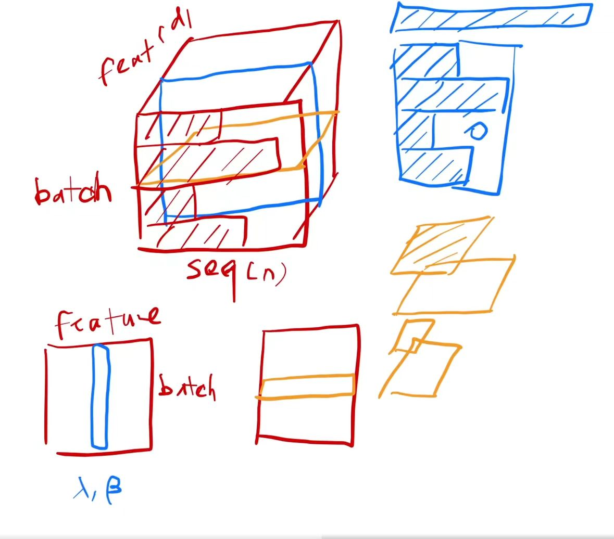
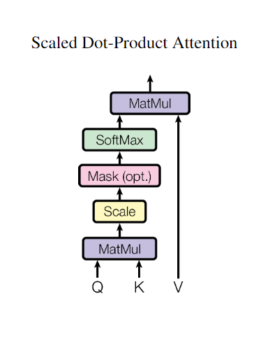

# Transformer
### 模型架构

Transformer模型由编码器（Encoder）和解码器（Decoder）两部分组成，这两部分都采用了自注意力机制。

#### • 编码器（Encoder）：

由6个相同的层组成，每层包括两个子层：

• 多头自注意力层（Multi-Head Self-Attention）：允许模型在不同的表示子空间中关注信息。

• 逐位置的前馈神经网络（Position-wise Feed-Forward Networks）：对每个位置的输入分别应用相同的全连接层。

+残差连接（residual connection）

##### LayerNorm
batch:对特征求均值方差  
layer：对样本求均值方差  ->稳定

#### • 解码器（Decoder）：

也由6个相同的层组成，每层包含三个子层：

• 掩蔽自注意力层（Masked Multi-Head Self-Attention）：防止未来信息的泄露，确保解码器在生成序列时只能看到之前的输出。

• 编码器-解码器注意力层（Encoder-Decoder Attention）：允许解码器的每个位置都能关注编码器的所有位置。

• 逐位置的前馈神经网络：与编码器中的相同。

+残差连接（residual connection）

#### 注意力机制

• 缩放点积注意力（Scaled Dot-Product Attention）：计算查询（query）和键（key）的点积，然后通过softmax函数获得权重。

• 多头注意力（Multi-Head Attention）：将查询、键和值线性投影多次，然后在每个投影版本上并行执行注意力函数，最后将结果拼接并再次投影。

3.位置编码（Positional Encoding）

由于Transformer模型不使用RNN或CNN结构，因此需要一种方式来编码序列中单词的位置信息。Transformer使用正弦和余弦函数的不同频率来为每个位置生成位置编码：

\[PE(pos,2i)=\sin(pos/10000^{2i/d{model}})\]
\[PE(pos,2i+1)=\cos(pos/10000^{2i/d{model}})\]

其中，\(pos\)是位置，\(i\)是维度。

4.训练方法

• 数据和批处理：使用标准的数据集，如WMT 2014英德数据集，进行训练。

• 硬件和时间：在8个GPU上进行训练，基础模型训练12小时，大型模型训练3.5天。

• 优化器：使用Adam优化器，并根据训练步骤调整学习率。

• 正则化：包括残差dropout和标签平滑等技术。

5.应用案例

Transformer模型不仅在机器翻译领域取得了成功，还被广泛应用于文本生成、摘要、对话系统等NLP任务。例如，它可以用于实现自动问答和对话交互，以及生成连贯、自然的文本和提取关键信息生成摘要或总结。

Transformer模型的代码实现和训练细节可以在相关的技术博客和论文中找到，这些资源提供了模型的深入理解和实际应用的指导。