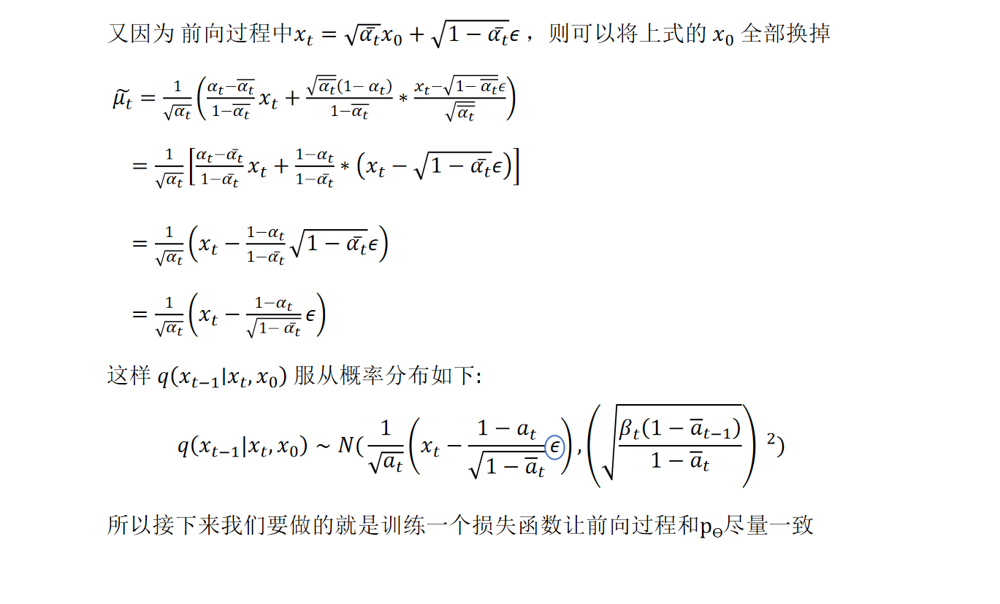
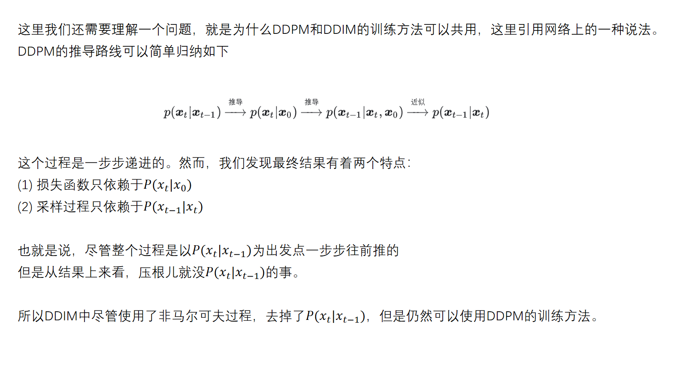

# 扩散模型
#### 前置知识
1. 高斯分布   
2. 重参数技巧：将随机采样过程转换为可导的运算,从而使得梯度下降算法可以正常工作  具体表现为，首先从标准高斯分布中采样一个随机噪声向量（通常记作𝝐）。然后，通过一个神经网络或其他可微分的映射函数，将这个随机噪声向量与模型的均值和标准差参数相结合，生成最终的潜在变量。这个潜在变量被用于生成样本，同时也与损失函数相关联，使得可以通过反向传播来更新梯度。
3. 对数似然  对数似然在统计学和机器学习中是衡量模型好坏的重要指标。给定一组观测数据我们希望最大化其在模型下的对数似然logp_θ(x_0)。这可以理解为我们希望找到一个参数 𝜃使得在该参数下，模型生成观测数据的概率最大。对于生成模型来说，这意味着我们希望模型能够尽可能精确地生成与真实数据分布相匹配的数据。
4. KL散度  KL散度是衡量两个概率分布之间差异的一种方法。具体来说，KL散度用于量化一个分布 𝑄与另一个分布 𝑃之间的信息损失或距离。

5. score-based-model

## 1.DDMP
#### 1.1简介   

DDPM将图像生成看成一种马尔科夫链，即 x_t 的生成仅依赖于 x_t−1 或 x_t+1 ，则前向过程 (虚线) 和反向过 (实线) 程可以表示为上图
前向扩散过程也是加噪过程，将高斯噪声逐渐添加到图像中，直到最终产生纯噪声
反向扩散过程则是去噪过程，从纯噪声开始逐渐对图像进行降噪，直到最终得到实际图像。
理论上，如果我们假设 ==x_0 （原始图像）是从某个高斯分布中采样得来的==，那么这个高斯分布可以写为:

#### 1.2正向加噪

前向过程需要对公式重复t次，非常耗时，希望仅采样一次，即得到状态t时刻的样本

具体计算

总

#### 1.3逆向去噪

具体计算

总

#### 1.4损失函数
==概念没懂==

具体计算优化

## 2.DDIM
反向过程使用待定系数法  
DDIM采用了非马尔科夫链的形式，更新了采样方法，使模型采样过程可以实现跳步，加快了采样速度，使模型生成图片的时间大幅减小。

DDPM分析

DDIM

## 3.Guided Diff